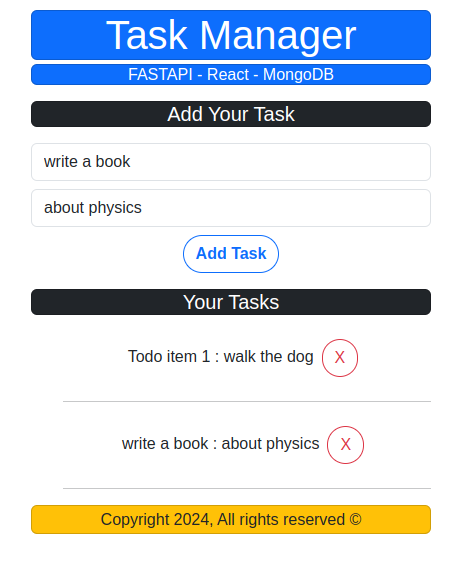

# Todo App with MongoDB and FastAPI and React

thanks to [Bek Brace](https://github.com/BekBrace).

## App UI

## How to run

in backend folder:

`$ pip install -r requirements.txt`
and then:
`$ uvicorn main:app --reload`

in frontend folder:

`$ npm start`

