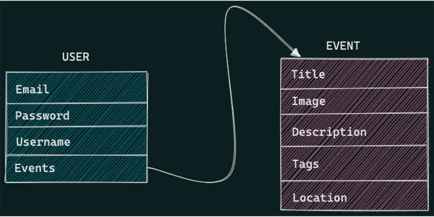
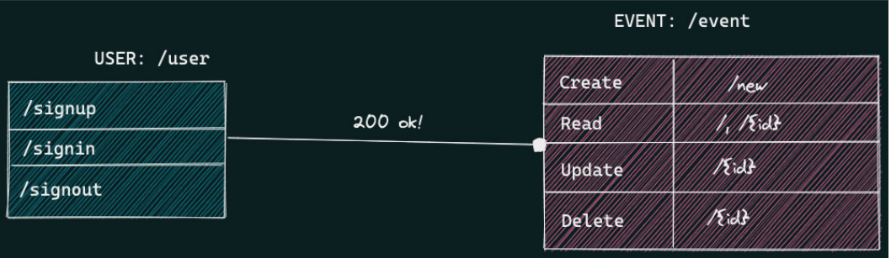

# Planner App

## Diagrams

model flow for the user and event:

The routes for user and event operations

## Testing

(venv)$ python main.py

>> signUp
(venv)$ curl -X 'POST' \
'http://0.0.0.0:8081/user/signup' \
-H 'accept: application/json' \
-H 'Content-Type: application/json' \
-d '{
"email": "fastapi@email.com",
"password": "Stro0ng!",
"username": "FastAPI"
}'

>> SignIn
curl -X 'POST' \
'http://0.0.0.0:8080/user/signin' \
-H 'accept: application/json' \
-H 'Content-Type: application/json' \
-d '{
"email": "fastapi@email.com",
"password": "Stro0ng!"
}'

>> get events
(venv)$ curl -X 'GET' \
'http://0.0.0.0:8080/event/' \
-H 'accept: application/json'

>> post event
(venv)$ curl -X 'POST' \
'http://0.0.0.0:8080/event/new' \
-H 'accept: application/json' \
-H 'Content-Type: application/json' \
-d '{
"id": 1,
"title": "FastAPI Book Launch",
"image": "https://linktomyimage.com/image.png",
"description": "We will be discussing the contents
of the FastAPI in this event.Ensure to come
with your own copy to win gifts!",
"tags": [
"python",
"fastapi",
"book",
"launch"
],
"location": "Google Meet"
}'

>> get event

(venv)$ curl -X 'GET' \
'http://0.0.0.0:8080/event/1' \
-H 'accept: application/json'

>> delete events

(venv)$ curl -X 'DELETE' \
'http://0.0.0.0:8080/event/1' \
-H 'accept: application/json'

## Tips

