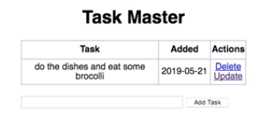

# Todo app with Flask framework

from: [Jake Rieger tutorial](https://github.com/jakerieger)

## App UI

## how to use

`$ (env) pip install -r requirements.txt`

and:

`$ (env) python app.py`

This server will start on port 5000 by default. You can change this in app.py by changing the following line to this:

`if __name__ == "__main__":
    app.run(debug=True, port=<desired port>)`

    