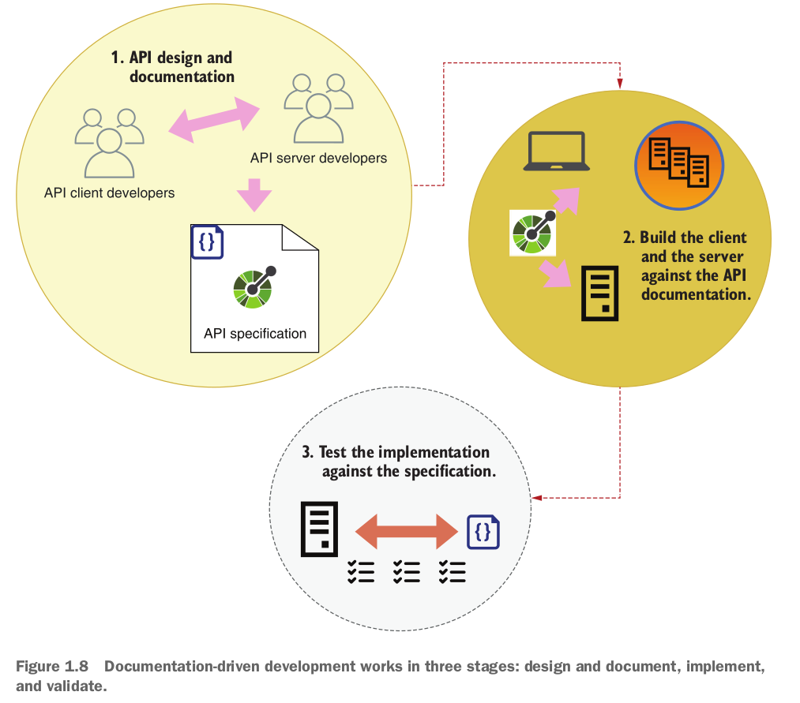

# Microservices Intro

## What are microservices

### Defining microservices

Microservices are small, autonomous services that work together.

A microservice is an architectural style in which components of a
system are designed as independently deployable services. Microservices are
designed around well-defined business subdomains, and they talk to each
other using lightweight protocols, such as HTTP.

### Microservices vs monoliths

A monolith is an architectural pattern in which the whole applica-
tion is deployed as a single build.

Because microservices contain smaller code bases than a monolith, and because
their logic is self-contained and defined within the scope of a specific business subdo-
main, it is easier to test them, and their test suites run faster.

## what are web apis

An API is an interface that allows us to programmatically interact with an application.

A web API is an API that uses the Hypertext Transfer Protocol (HTTP) protocol
to transport data.

the most important challenges that microservices pose:

 Effective service decomposition
 Microservices integration tests
 Handling service unavailability
 Tracing distributed transactions
 Increased operational complexity and infrastructure overhead

## Documentation-driven development intro

documentation-driven development is an approach to building APIs that works
in three stages:

1- You design and document the API.

2- You build the API client and the API server following the documentation.

3- You test both the API client and the API server against the documentation.

What is API documentation? API documentation is a description of the API following a standard interface description language (IDL), such as OpenAPI for REST APIs and the Schema Definition Language (SDL) for GraphQL APIs.

